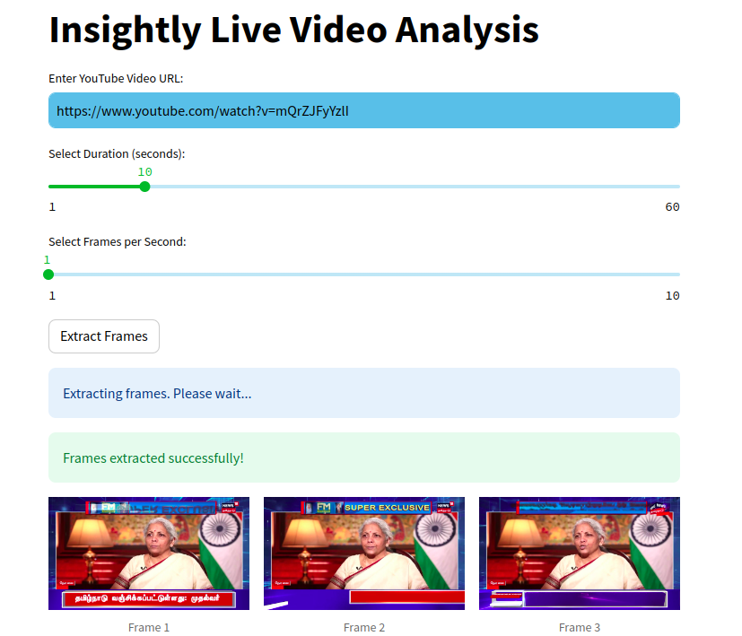
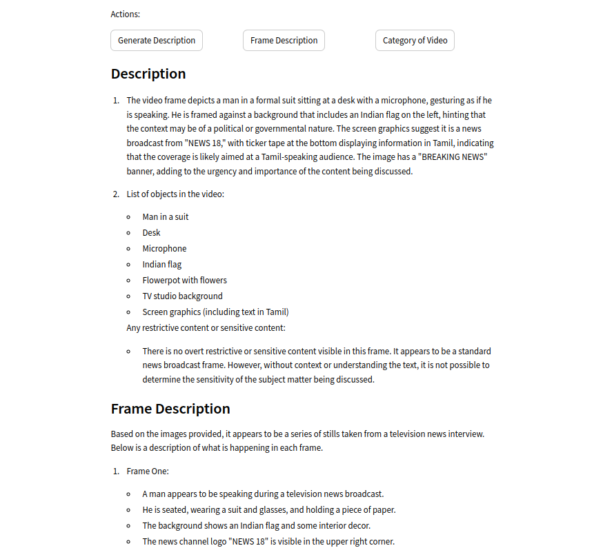
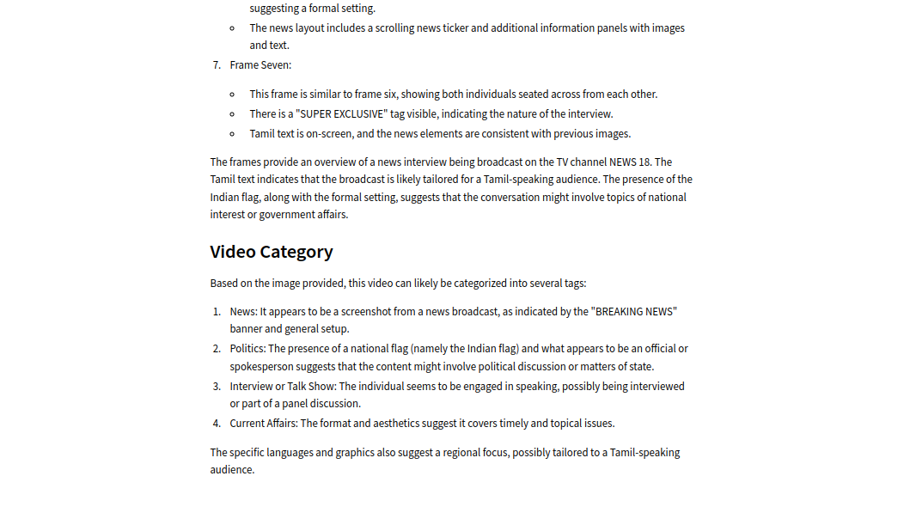

# Live Frame Analysis
Live Frame Analysis is a tool developed to analyze live video streams from YouTube. It extracts frames from the video, generates descriptions, provides frame-by-frame descriptions, and suggests categories for the video content. This tool leverages OpenAI's GPT-4 model and Google's Streamlink library for video stream processing.

# Features
Frame Extraction: Extract frames from a YouTube video stream.
Description Generation: Generate a description for the entire video sequence.
Frame Description: Provide descriptions for each frame extracted from the video.
Video Category Prediction: Suggest categories for the video content.

# Getting Started
To use Insightly Live Video Analysis, follow these steps:
Install the required dependencies listed in requirements.txt.
Set up your environment with necessary API keys for OpenAI and Streamlink.
Run the script app.py.
Enter the YouTube video URL, select the duration and frames per second, and click "Extract Frames".
Analyze the generated content, including video description, frame descriptions, and suggested categories.

# Dependencies
OpenAI: For natural language processing and text generation.
Streamlink: For extracting video streams from YouTube.
OpenCV: For image processing tasks.
Streamlit: For building interactive web applications.
dotenv: For loading environment variables from a .env file.

# Usage
You can run the application by executing main.py. Make sure to set up your environment with appropriate API keys for OpenAI and Streamlink.
```python
streamlit run app.py
```






# License
This project is licensed under the MIT License.

Contributing
Contributions are welcome! Feel free to submit issues or pull requests.
